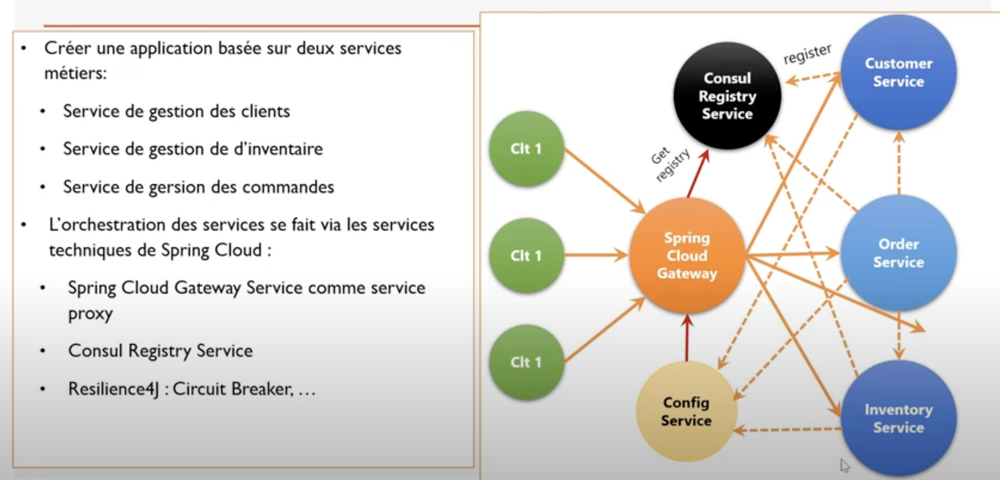
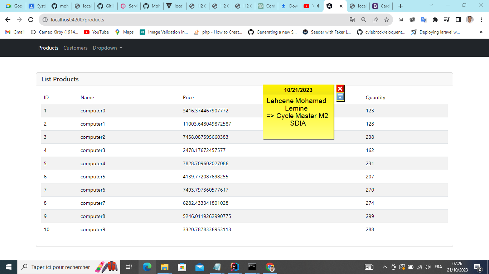
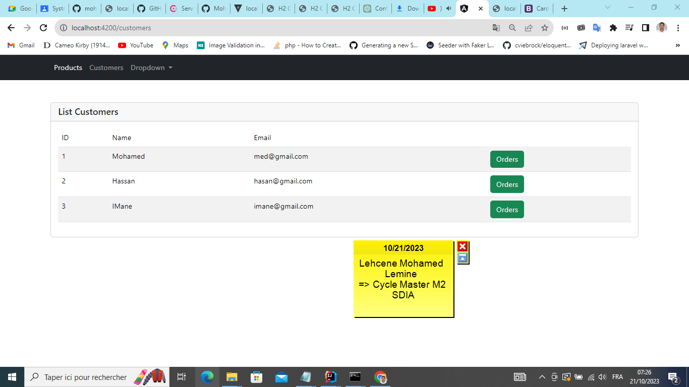
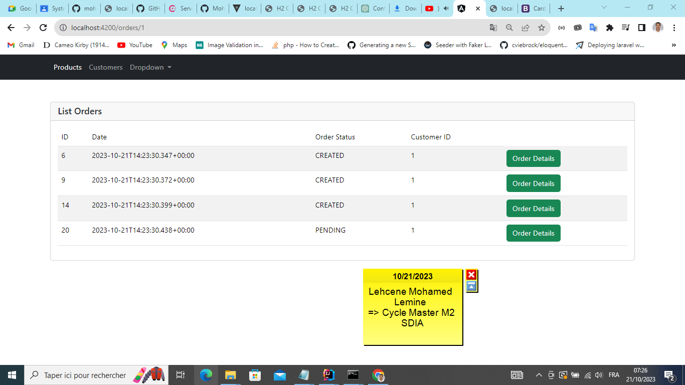
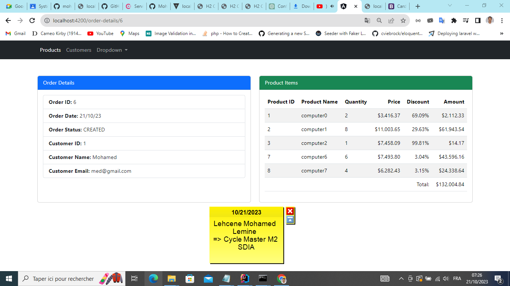
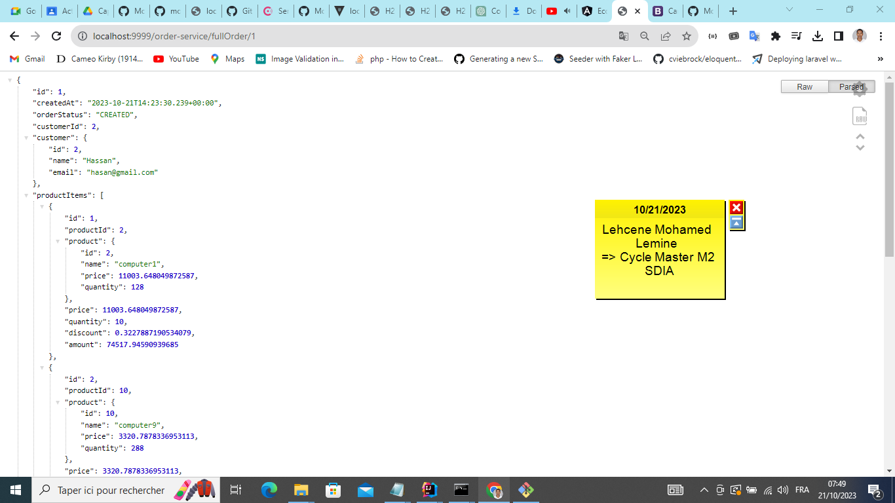

<h2>Compte rendu pour réaliser une application e-commerce en utilisant une architecture micro-services pour la partie back-end et Angular pour la partie front-end, tout en respectant les principes de développement de systèmes parallèles et distribués.</h2>
<h3>Captures </h3>

<ul>
    <li>Architecture micro service avec Spring Cloud </li>
 
    

<li></li>

<li></li>

<li></li>

<li></li>

<li></li>

</ul>

